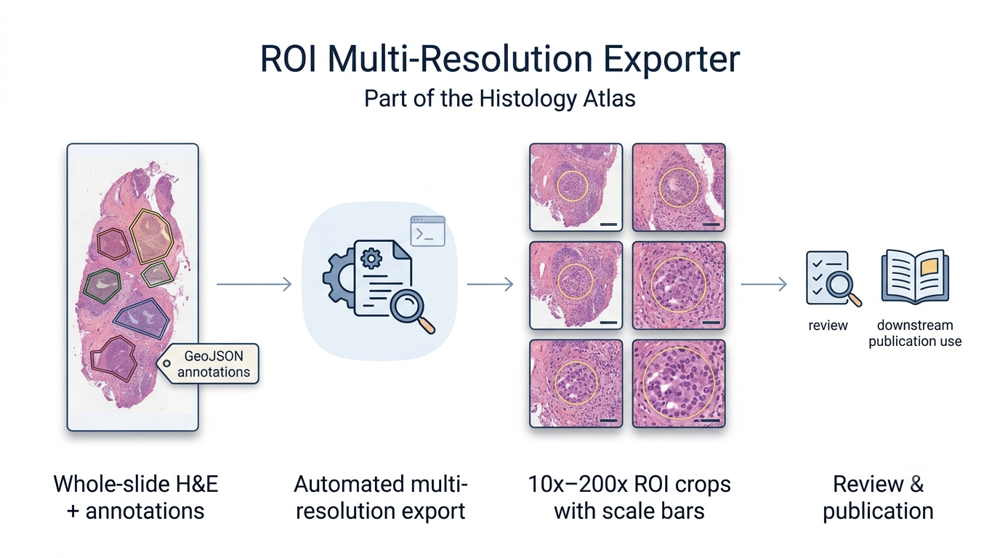

# QuPath ROI Exporter

Command-line tool for cropping multi-resolution regions of interest (ROIs) out of whole-slide OME-TIFF images using [QuPath](https://qupath.github.io/). Given an H&E OME-TIFF and a matching GeoJSON annotation file, it exports crops around each annotation at whatever magnifications you specify (e.g. 10x, 20x, 40x, 60x, 100x, 200x), with optional ROI boundary overlays and scale bars.



## How it works

- `bin/run_export.sh` — the command-line entry point. Validates inputs,
  resolves the QuPath executable, and invokes QuPath's headless `script`
  command.
- `scripts/export_multires_ROIs.groovy` — the QuPath script that does the
  actual work: imports the GeoJSON annotations, optionally re-shapes them
  into fixed-radius circles, and exports crops at each requested
  magnification.
- `examples/single_file_example.sh` — runs the exporter on a single
  sample OME-TIFF / GeoJSON pair checked into the repo, so you can try the
  tool immediately after cloning with no external data needed.
- `examples/batch_example.sh` — example of looping the exporter over
  multiple samples.
- `examples/sample_data/` — a small (~96MB) sample OME-TIFF crop and
  matching GeoJSON annotations used by `single_file_example.sh`.
- `tools/crop_sample_ome_tiff.groovy` — utility used to generate the sample
  OME-TIFF above by cropping a small pixel region out of a larger
  whole-slide image. Useful if you want to make your own small test dataset
  out of a large slide.

## Requirements

- **QuPath** version 0.5 or later (tested with 0.7.0). QuPath bundles its
  own Java runtime, so no separate JDK install is needed.
- **Bash** (macOS/Linux: preinstalled; Windows: via Git Bash or WSL — see
  below).
- Input OME-TIFF must have pixel size (microns-per-pixel) calibration
  metadata — this is required to compute magnification-equivalent
  downsamples.

## Installing QuPath

### macOS

1. Download the macOS build (`.pkg` or `.dmg`, matching your chip — Apple
   Silicon vs Intel) from the [QuPath releases page](https://qupath.github.io/).
2. Open the installer and drag `QuPath.app` into `/Applications`.
3. The executable used by this tool lives inside the app bundle at:
   ```
   /Applications/QuPath.app/Contents/MacOS/QuPath
   ```
   If macOS renamed the app on install (e.g. `QuPath-0.7.0-arm64.app`), the
   executable path changes to match:
   ```
   /Applications/QuPath-0.7.0-arm64.app/Contents/MacOS/QuPath-0.7.0-arm64
   ```
4. On first launch, macOS Gatekeeper may block the app — right-click
   `QuPath.app` in Finder and choose **Open** once to approve it.

### Linux

1. Download the Linux build (`.tar.xz`) from the
   [QuPath releases page](https://qupath.github.io/).
2. Extract it somewhere convenient, e.g.:
   ```bash
   mkdir -p ~/QuPath
   tar -xJf QuPath-v0.7.0-Linux.tar.xz -C ~/QuPath --strip-components=1
   ```
3. The executable is at:
   ```
   ~/QuPath/bin/QuPath
   ```
4. Make sure it's executable: `chmod +x ~/QuPath/bin/QuPath`

### Windows

1. Download the Windows build (`.msi`) from the
   [QuPath releases page](https://qupath.github.io/).
2. Run the installer (default install location is
   `C:\Program Files\QuPath\`).
3. This tool is a Bash script, so it needs a Bash environment on Windows —
   use one of:
   - **Git Bash** (installed with [Git for Windows](https://gitforwindows.org/)) — simplest option.
   - **WSL** (Windows Subsystem for Linux) — if you prefer a full Linux
     environment.
4. From Git Bash, the QuPath executable path uses forward slashes and a
   `/c/` drive prefix:
   ```
   /c/Program Files/QuPath/QuPath.exe
   ```

## Setting up the QuPath path

`run_export.sh` looks for QuPath in this order:

1. The `--qupath /path/to/QuPath` command-line flag (highest priority).
2. The `QUPATH_EXE` environment variable.
3. Common default install locations for your OS (auto-detected).

For day-to-day use, set `QUPATH_EXE` once in your shell profile so you never
need to pass `--qupath` manually.

**macOS / Linux** — add to `~/.zshrc` (macOS default shell) or `~/.bashrc`
(Linux / older macOS):
```bash
export QUPATH_EXE="/Applications/QuPath.app/Contents/MacOS/QuPath"
```
Then reload: `source ~/.zshrc` (or open a new terminal).

**Windows (Git Bash)** — add to `~/.bashrc` or `~/.bash_profile`:
```bash
export QUPATH_EXE="/c/Program Files/QuPath/QuPath.exe"
```

To verify it resolved correctly, run `run_export.sh --help` — if QuPath
cannot be found, the script will print an error only when you actually try
to run an export (not for `--help`).

## Installation of this tool

```bash
git clone https://github.com/<your-org>/qupath-roi-exporter.git
cd qupath-roi-exporter
chmod +x bin/run_export.sh examples/*.sh
```

No further build step is needed — `bin/run_export.sh` calls QuPath directly.

## Quickstart

Try it immediately on the sample dataset checked into the repo — no
external data needed:

```bash
./examples/single_file_example.sh
```

This exports crops from `examples/sample_data/sample_data.ome.tif` using
`examples/sample_data/annotations.geojson` into
`examples/sample_data/roi_crops/`. Open one of the resulting PNGs to
confirm the ROI boundary and scale bar render correctly — that confirms
your QuPath install and path setup both work.

## Usage

```bash
./bin/run_export.sh <ome_tiff> <geojson> <output_dir> [options]
```

### Required positional arguments

| Argument      | Description                                  |
|---------------|-----------------------------------------------|
| `ome_tiff`    | Path to the H&E OME-TIFF file                 |
| `geojson`     | Path to the matching GeoJSON annotation file   |
| `output_dir`  | Directory to write exported crops into (created if missing) |

### Optional flags

| Flag | Default | Description |
|------|---------|-------------|
| `--roi-mode <original\|circle>` | `circle` | Use the annotation's original shape, or replace it with a fixed-radius circle centered on its centroid |
| `--radius <microns>` | `250.0` | Circle radius, only used if `--roi-mode circle` |
| `--crop-mode <annotation\|fixed_fov>` | `fixed_fov` | Crop to the ROI's own bounding box, or to a fixed physical field-of-view centered on it (true zoom behavior across magnifications) |
| `--magnifications <csv>` | `10,20,40,60,100,200` | Comma-separated magnifications to export, e.g. `20,40` |
| `--format <png\|tif\|jpg>` | `png` | Output image format |
| `--jpeg-quality <0.0-1.0>` | `0.95` | Only used if `--format jpg` |
| `--tiff-compression <LZW\|Deflate\|NONE>` | `LZW` | Only used if `--format tif` |
| `--png-compression-level <0-9>` | `6` | Only used if `--format png` |
| `--draw-boundary <true\|false>` | `true` | Draw the ROI boundary outline on exported crops |
| `--boundary-width <pixels>` | `3.0` | Boundary line width |
| `--add-scale-bar <true\|false>` | `true` | Draw a scale bar on exported crops |
| `--scale-bar-position <bottom-left\|bottom-right>` | `bottom-right` | Scale bar placement |
| `--add-circle-to-hierarchy <true\|false>` | `false` | Also add the generated circle ROI as a real annotation in the QuPath hierarchy |
| `--qupath <path>` | see [Setting up the QuPath path](#setting-up-the-qupath-path) | Path to the QuPath executable |
| `--script <path>` | `scripts/export_multires_ROIs.groovy` | Path to the Groovy script, if you want to override it |

### Example

```bash
./bin/run_export.sh \
    /data/slide01.ome.tiff \
    /data/slide01.geojson \
    /data/out \
    --roi-mode circle \
    --radius 300 \
    --magnifications 20,60,120 \
    --format jpg \
    --jpeg-quality 0.95 \
    --draw-boundary true
```

See `examples/batch_example.sh` for looping this over multiple samples.

## Troubleshooting

- **"QuPath executable not found"** — set `QUPATH_EXE` (see above) or pass
  `--qupath /path/to/QuPath` explicitly.
- **"This image has no pixel size (MPP) metadata"** — open the image in
  QuPath and set pixel calibration manually (Image tab, double-click pixel
  size), or re-export the OME-TIFF with calibration metadata intact.
- **macOS Gatekeeper blocks QuPath on first run** — right-click the app in
  Finder and choose Open once; afterwards it launches normally, including
  from this script.

## License

MIT — see [LICENSE](LICENSE).
